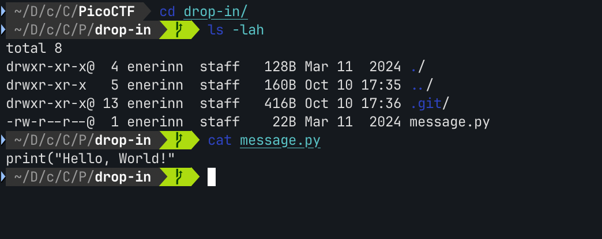

# Blame Game

Contains a .git folder and a *message.py*

Tried using `git log` and `git show [commit]` but there was nothing useful.

The `git blame` command shows you who made changes to each line of a file and when. It can help you identify who to consult if you have questions about specific changes.

`git blame message.py`