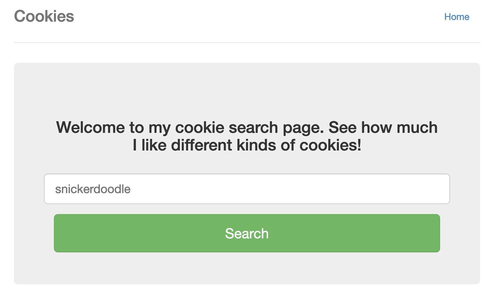
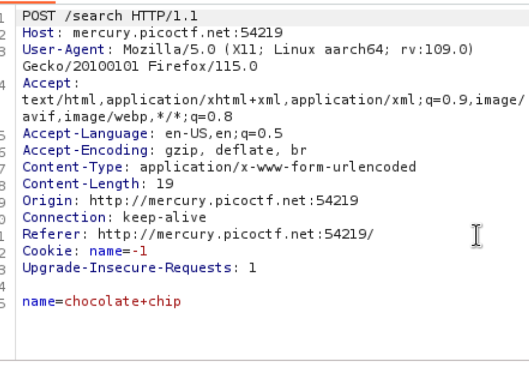

# Cookies

Looked through html and network tab but didn’t find anything.
Tried brute-forcing by changing the names of the cookies.

Then I noticed “Cookie: name=-1” and brute forced the value of name to get the flag.