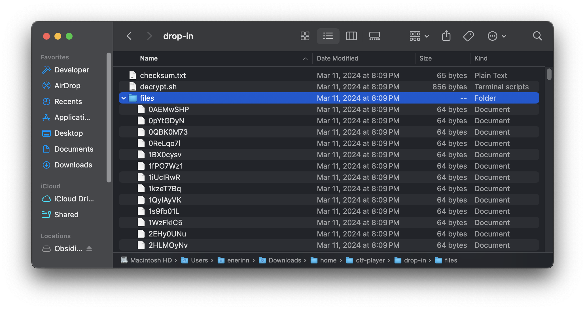
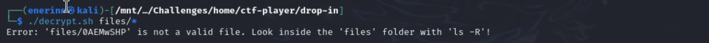

# Verify

Contains a *challenger.zip* file

with *checksum.txt*, *decrypt script*, and *sha-256 hash files*.

Tried to use decrypt script to decrypt files

Used `sha256sum files/*` to create a checksum of all files.
Passed the output into grep to find the file with the same checksum in checksum.txt.

Use `./decrypt files/87590c24` to get flag