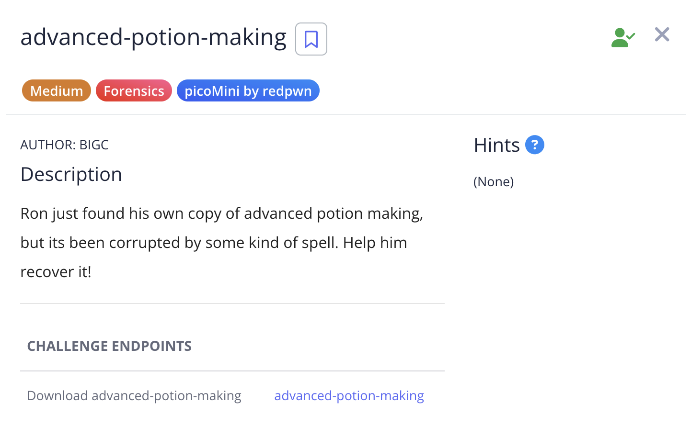
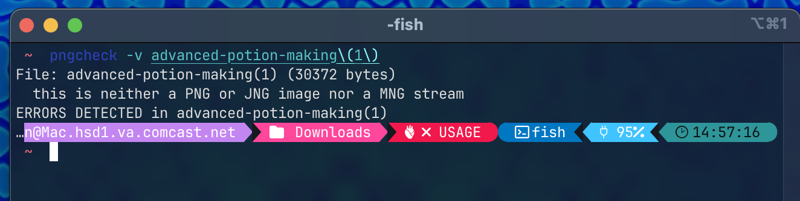
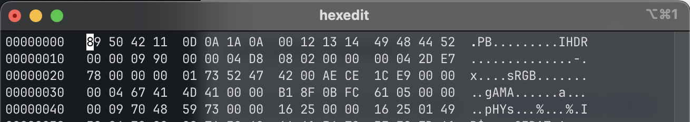
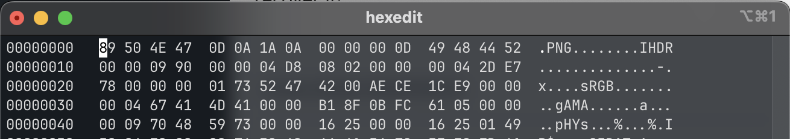
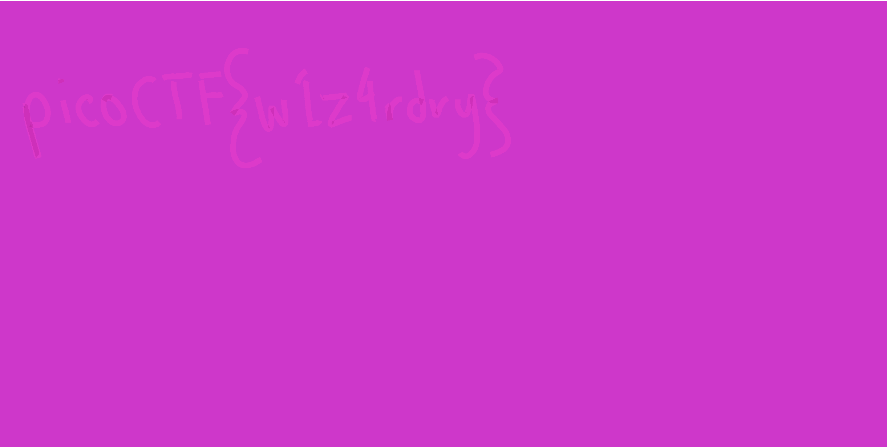

# Advanced Potion Making

I found that this was not a PNG img using pngcheck.

Using hexedit, I changed the magic number to the PNG since it was similar.

I changed the IHDR data length to 13 bytes since that is the expected length for a valid PNG image.

4 bytes before IHDR ( 0x49484452 ) represents the data length (in bytes)

Starting from after 0x52 to 0x04 is the data chunk; which is 13 bytes so data length should be 13 ( 0x0000000D ).

The 4 bytes from 0x04 to 0x78 is the CRC.

After changing the hex, it gave me an image.

I used StegOnline with option "LSB half" to get flag.

