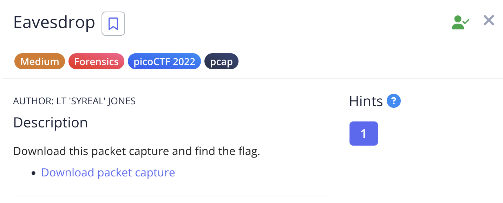
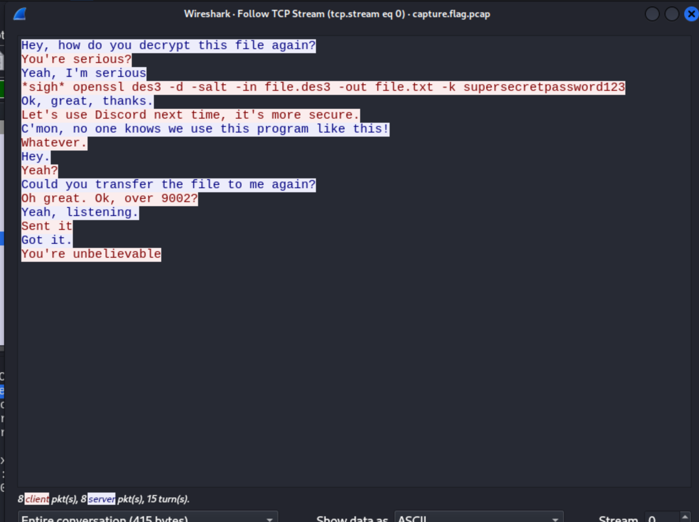
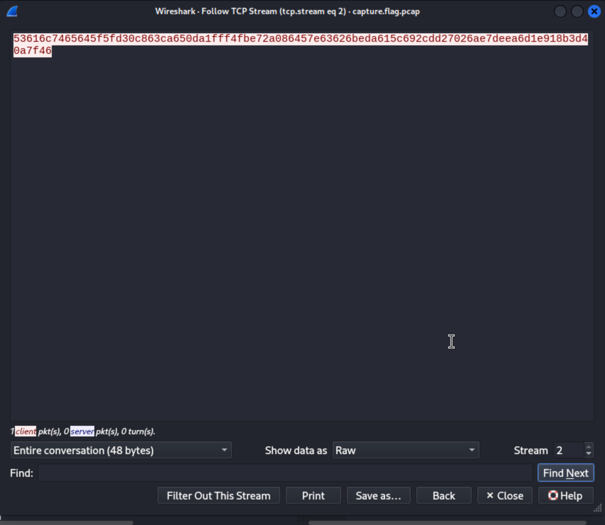

# Eavesdrop

In Wireshark, there was this tcp stream.

I filtered by `tcp.port == 9002` and followed the TCP stream. I changed “Show data as” to “Raw” and saved the file.

Then I used the command that we saw earlier `openssl des3 -d -salt -in file.des3 -out file.txt -k supersecretpassword123` to get the flag.