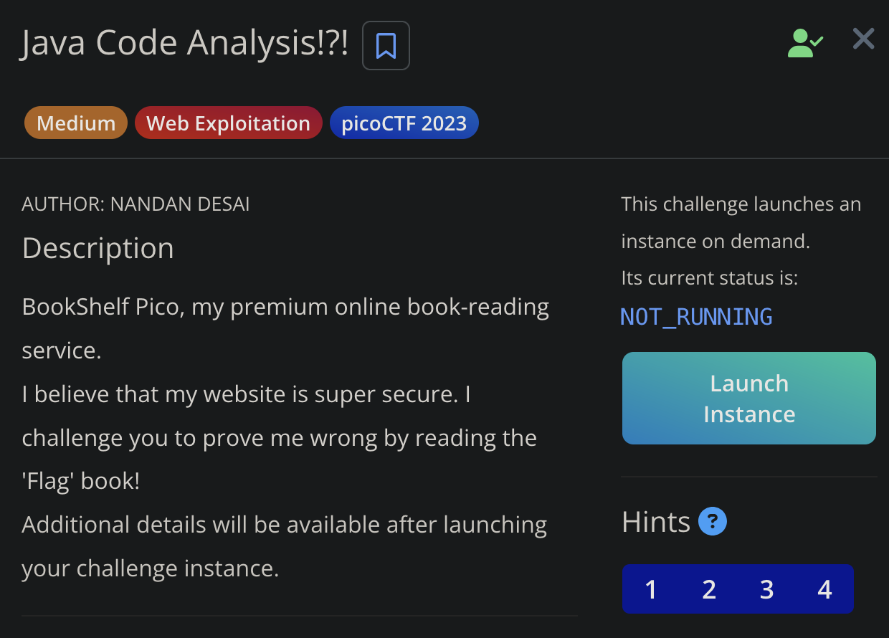
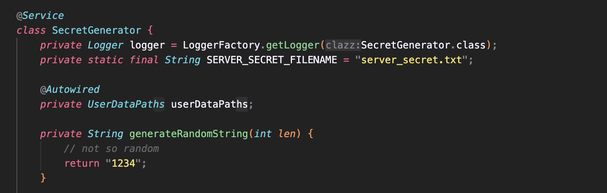
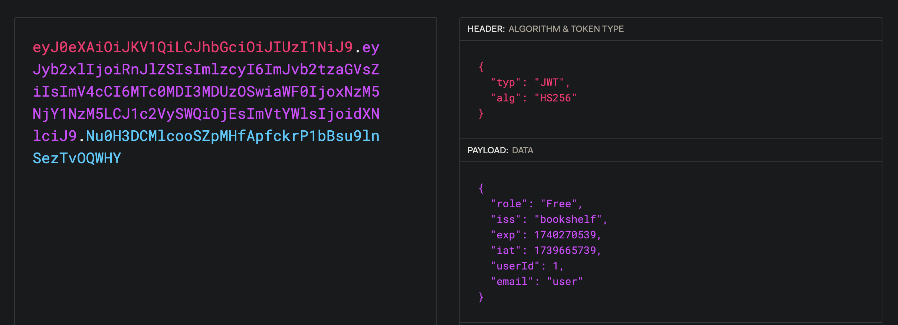
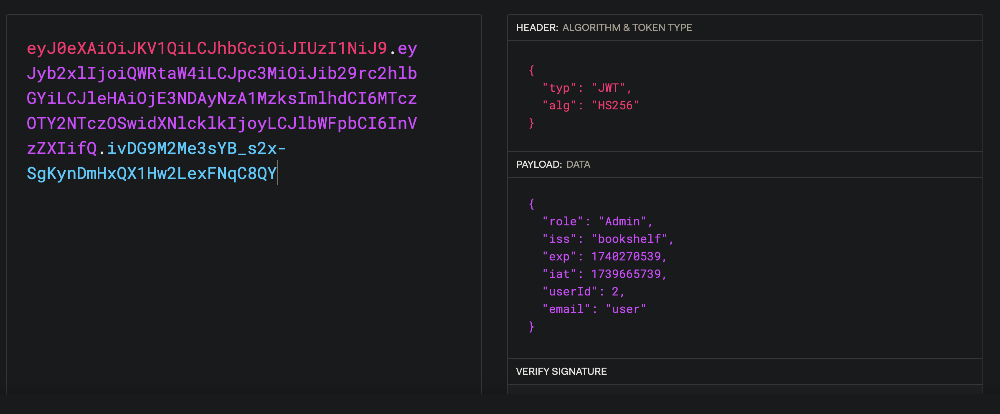
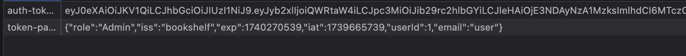
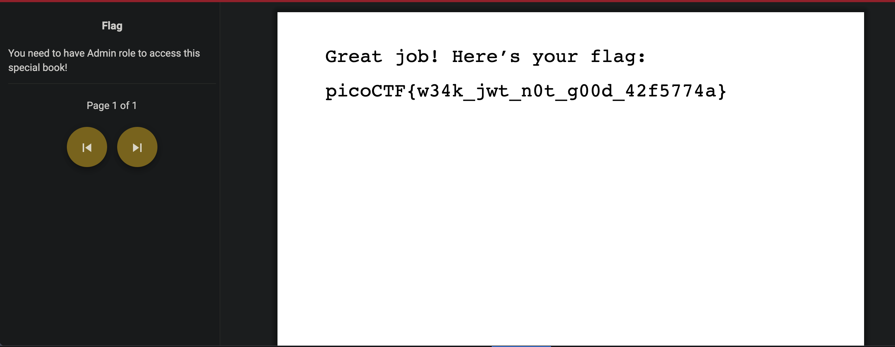

# Java Code Analysis!?!

I cracked the JWT token using hashcat to find out the secret signing key is “1234” but you can also find it in the source code.

Here we change to role to “Admin” and the userID to “2” (I had set userID to “0” since I thought that the admin account was created before the user but it didn’t work).

The server checks if the user is “Free” or “Admin” based on the “token-payload” so I changed the role to “Admin”

Now when I view the “Flag” book, it shows me the content.

