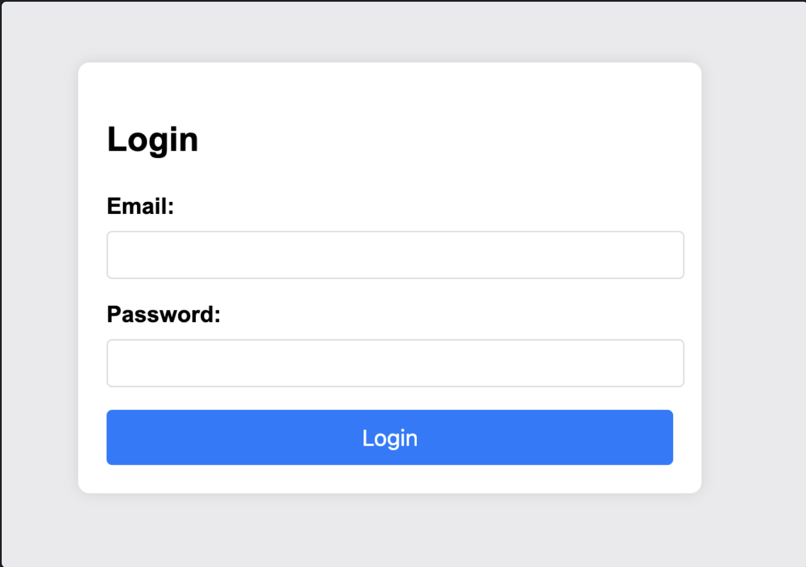
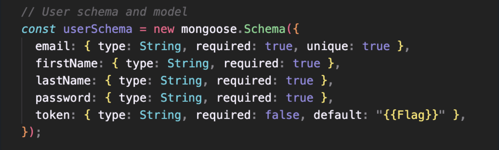
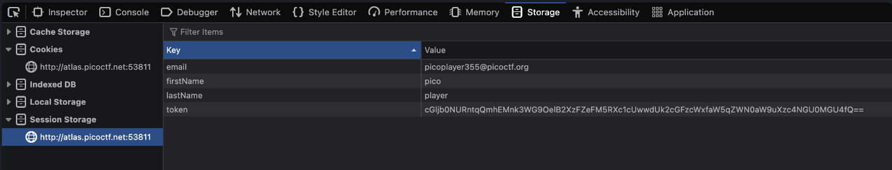
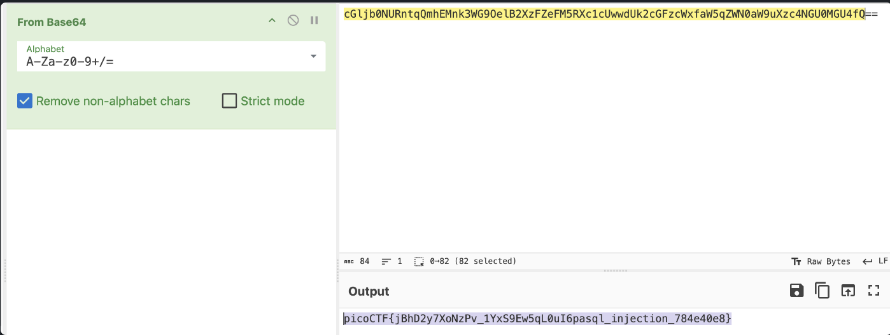

# No Sql Injection

There’s a login page, and I assume we are going to use no SQL injection to login.

I used `{ "$ne": null }` on email and password field and was able to get in.

In the code, it shows that the flag is returned in something like a cookie when the user logs in.

In the storage tab of inspect element, I found the token.

Using base64 decryption, I got the flag.

