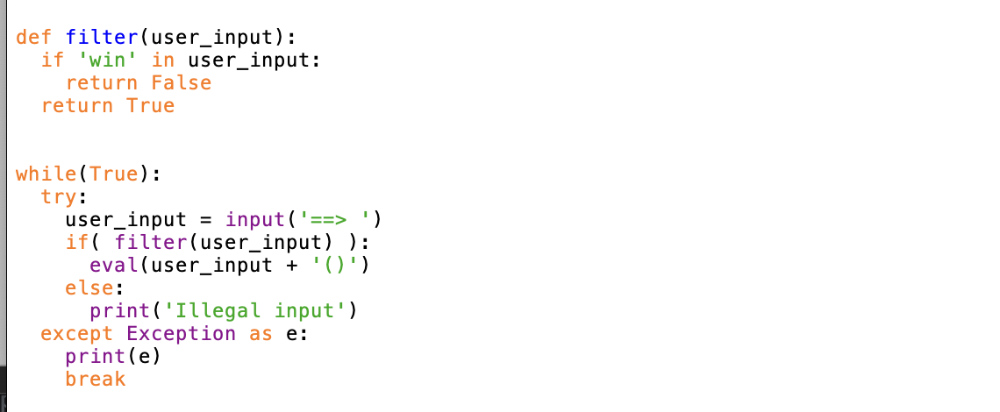
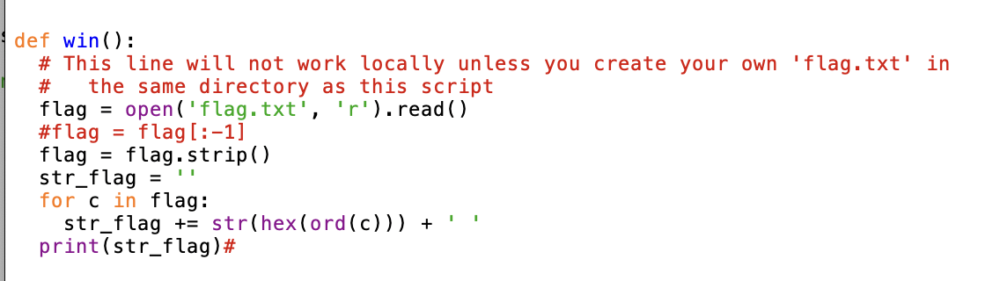

# Picker II

Program filters out the input “win”.
We can input out own commands and comment out the rest of the line with #. That means we can write our own win() function without calling the win() function.

The one liner for the win function is:
print(’ ‘.join(hex(ord(c)) for c in open(’flag.txt’).read().strip()))