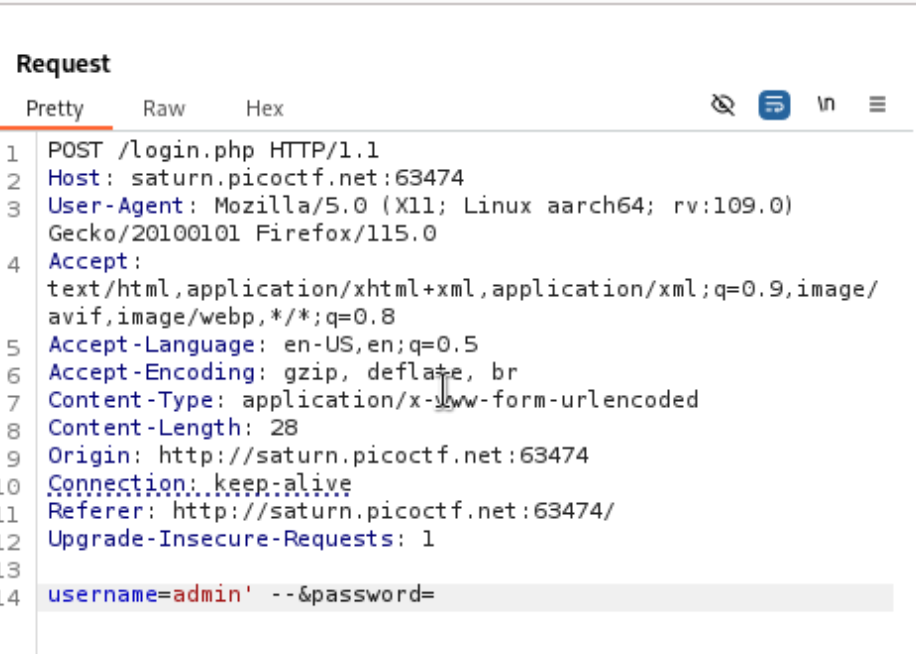

# SQLiLite

#web_exploit

A simple username and password website that has an SQLi vulnerability.

I tried

```bash
' OR 1=1/*
```

on both username and password but it didn’t work.

Then I tried:



and got the flag.