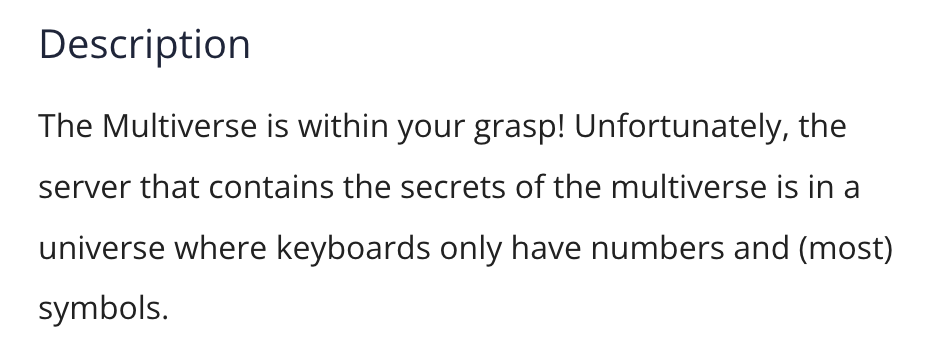
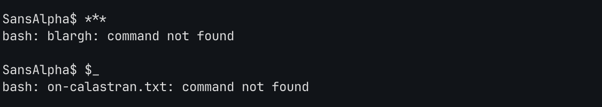
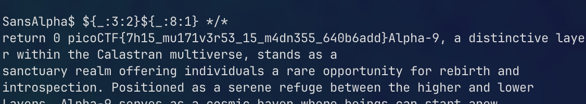

# SansAlpha

`**` represents any number of characters. In this case, it finds the first file or subdirectory that is at least 3 characters.

`$_` refers to the most recent output!

`${_:3:2}${_:8:1}` concats the most recent output, in this case “cat”
`${_:x:y}` takes the most recent output, start at x position, and concat y letters

