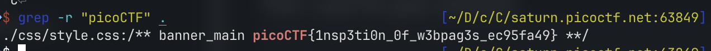

# Search Source

Given a website and told that the developer mistakenly left an important artifact in the website source.

I tried to manually search through the source file but there were a lot of js and css files.

The hint said to “mirror the website on local computer”.

I used the wget command to mirror the website:

```bash
wget --mirror --convert-links --adjust-extension --page-requisites --no-parent http://saturn.picoctf.net:63849/
```

Then I used the grep command to find the flag.

