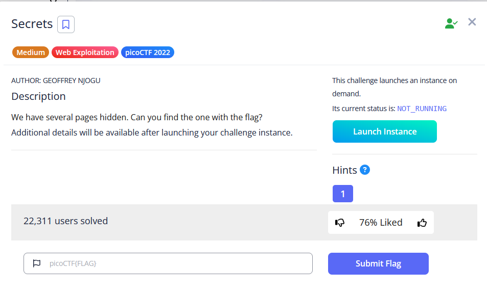

# Secrets

I saw that there is folder `/secret/assets/`. I tried to go to `/secret/` .

I went to `/secret/hidden/`

I saw that the css file is in `/superhidden/` so I went to `/secret/hidden/superhidden/`.

