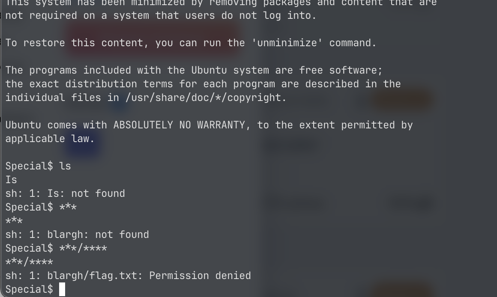
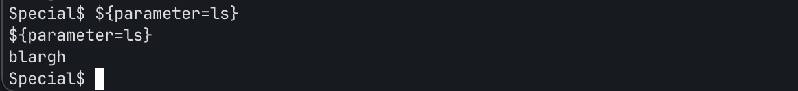

# Special

The shell capitalizes any command so the commands don’t work. I noticed the flag was in blargh/flag.txt using `***/****`

I saw a write-up saying to use `${parameter='command_here'}`.
This command is used for parameter expansion in shell scripting, which means that it assigns default values to the variable parameter if not already set.

I used `${parameter=cat blargh/flag.txt}` which gave me the flag.