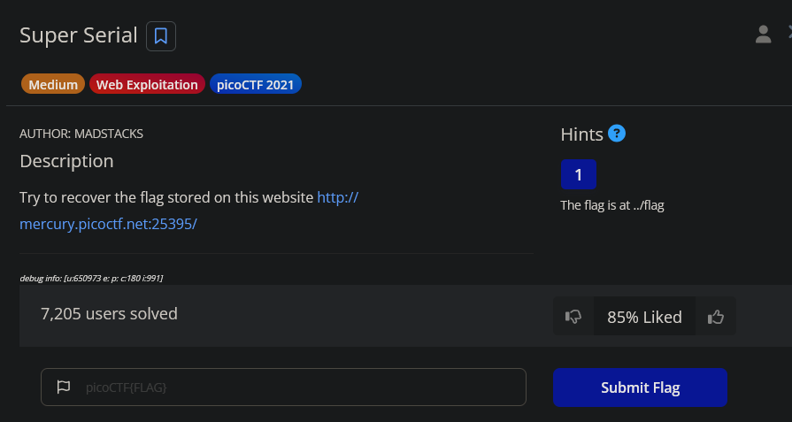
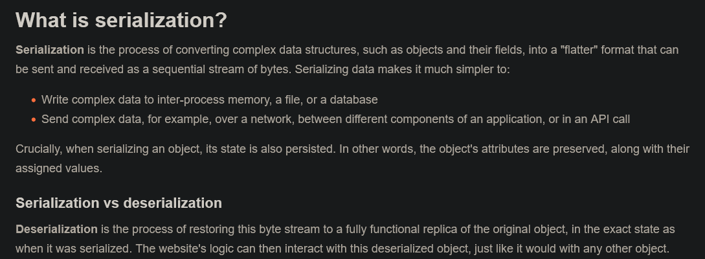
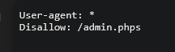
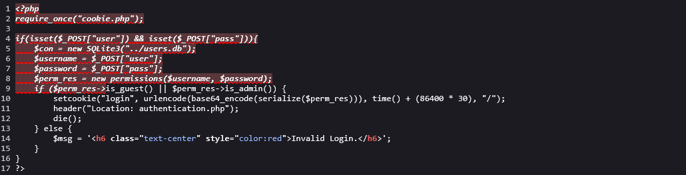
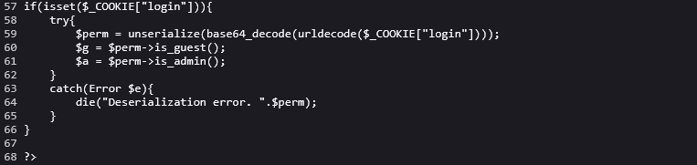
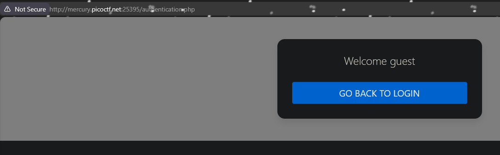
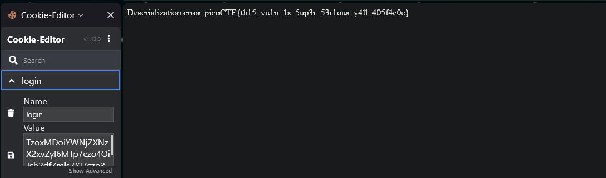

# Super Serial

(In hindsight, serial in this case refers to serialization, which means there could be a deserialization vulnerability)

In robots.txt file, there is a `/admin.phps` page. The page doesn’t exist when we try to go there.

When viewing the source code for `index.phps` , we found that there may also be a `cookie.phps` and `authentication.phps` 

### Authentication.phps

The access_log object has a toString function which calls the read_log function getting the value of the log_file and printing it out

### Cookie.phps

We want the error to run because it prints out `$perm` which is the unserialized object (flag). Notice we need to encode the cookie in base64

### Crafting the payload

`O:10:"access_log":1:{s:8:"log_file";s:7:"../flag";}`

- `O:10:"access_log"`: An object with 10-character class name "access_log"
- `1`: Object has one attribute (log_file)
- `s:8:"log_file"` : The key of the attribute is the 8-character string “log_file”
- `;` : Ends the property name
- `s:7:"../flag"` : The value of the attribute is a 7-character string called “../flag”

Encrypted to base64: `TzoxMDoiYWNjZXNzX2xvZyI6MTp7czo4OiJsb2dfZmlsZSI7czo3OiIuLi9mbGFnIjt9` 

We navigate to `authentication.php` page to access the authentication page.

Pasted the encrypted cookie.

