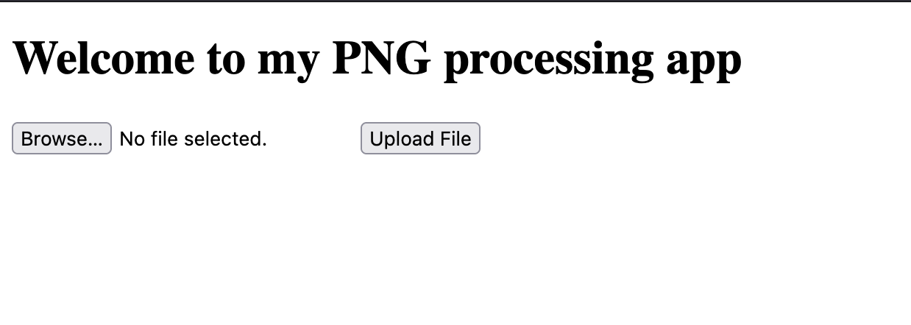
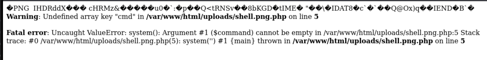

# Trickster

Only accepts png file.
Looked at burpsuite and source code but nothing interesting.

Contains a /uploads/ path to open the png uploaded.

In the response packets, I saw that the website uses PHP/8.0.30.

I tried to upload a .png and .php.png containing php code but it renders the image only.

I created an image.png and payload.php using:

Then I combined the two together since the website checks for PNG magic number.

I uploaded shell.php.png to the website and intercepted the request, changing the name to shell.png.php.

Then I navigated to the /uploads/shell.png.php.

This shows that our php exploit is working.

Using find / –iname “*txt”, I found the list of files with txt extension.

The flag was in /var/www/html/GNTDOMBWGIZDE.txt