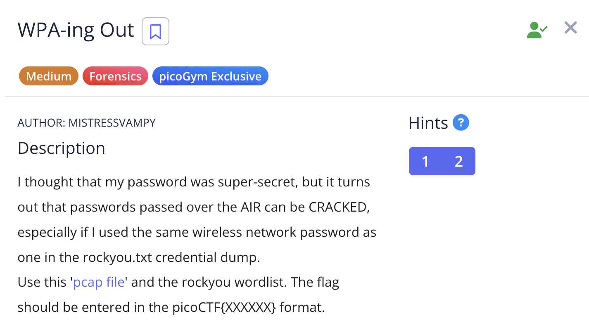
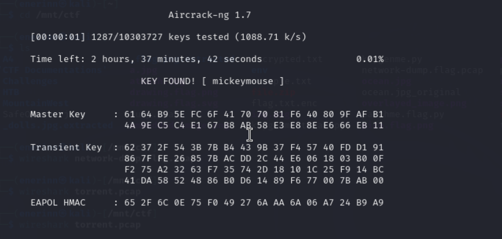

# WPA-ing Out

I opened the pcap with Wireshark but didn’t know how to find the WPA password. I read an [article](https://predatech.co.uk/capturing-and-cracking-wpa-wpa2-wifi-passwords/) about how to crack wpa passwords and it said to use aircrack-ng which aligns with why AIR CRACKED was emphasized in the description.

I used the command `sudo aircrack-ng -w rockyou.txt wpa-ing_out.pcap` to get the cracked password.

