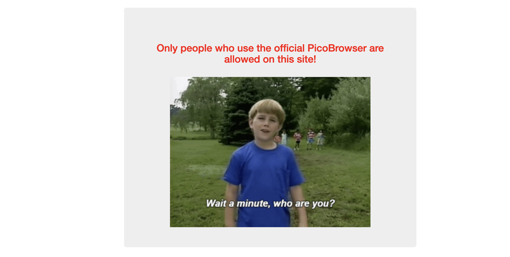
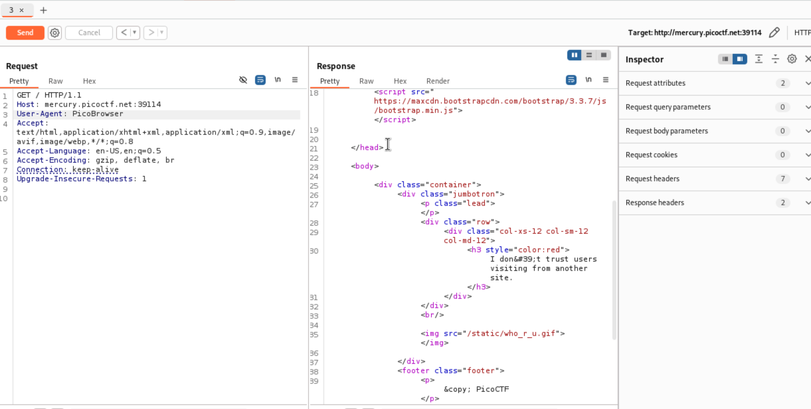
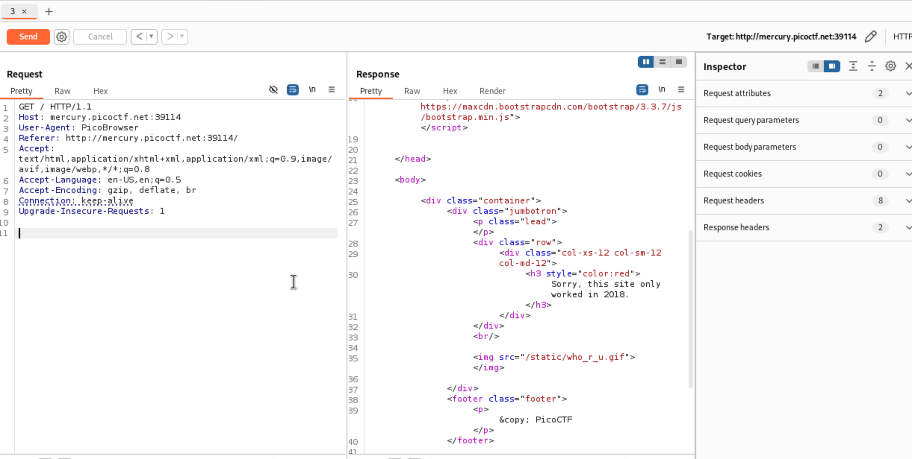
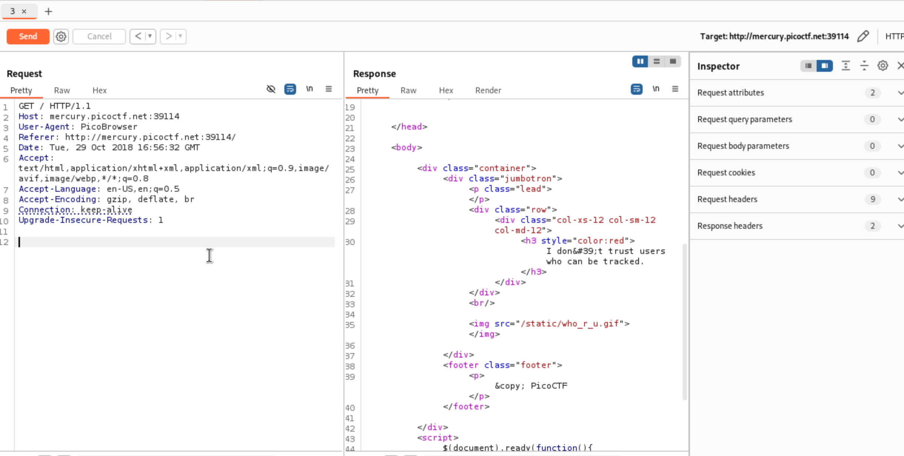
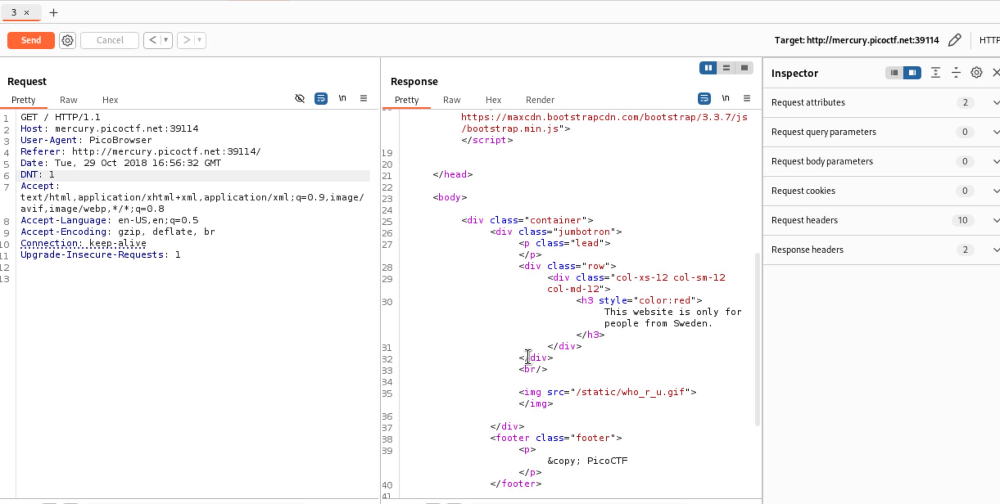
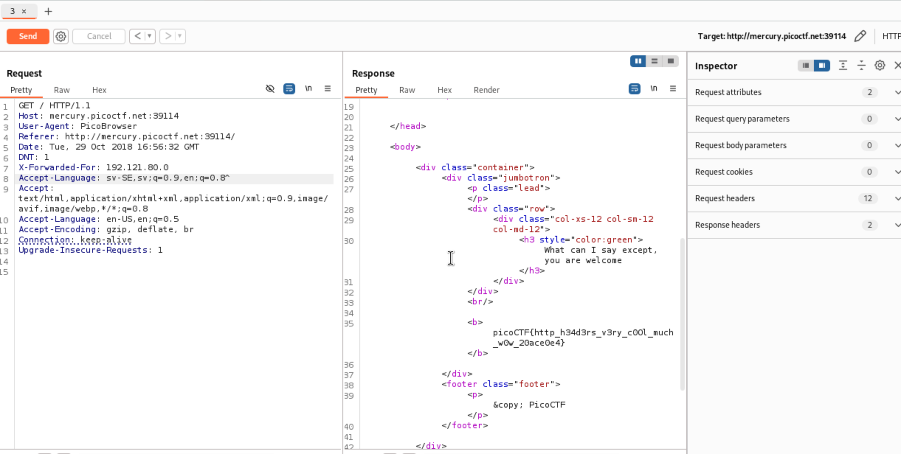

# Who are you?

I changed the User-Agent to `PicoBrowser`.

It doesn’t trust users visiting from another site, so I add a referer, which the server use to identify where the request came from.

I added a date since it only works in 2018.

I added `DNT: 1`, which is “Do not track”.

I added `X-Forwarded-For: 192.121.80.0` which a range geolocated to Sweden.!

I included Swedish in the accepted language `sv-SE`.![[wru7.png]]

